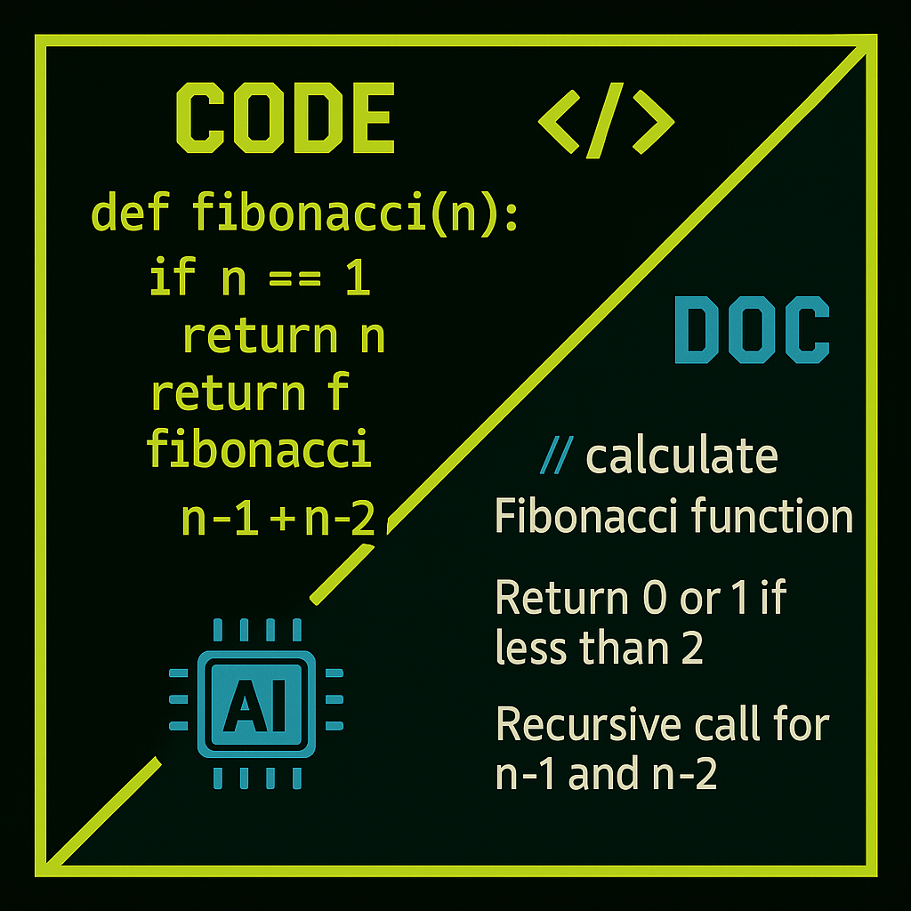
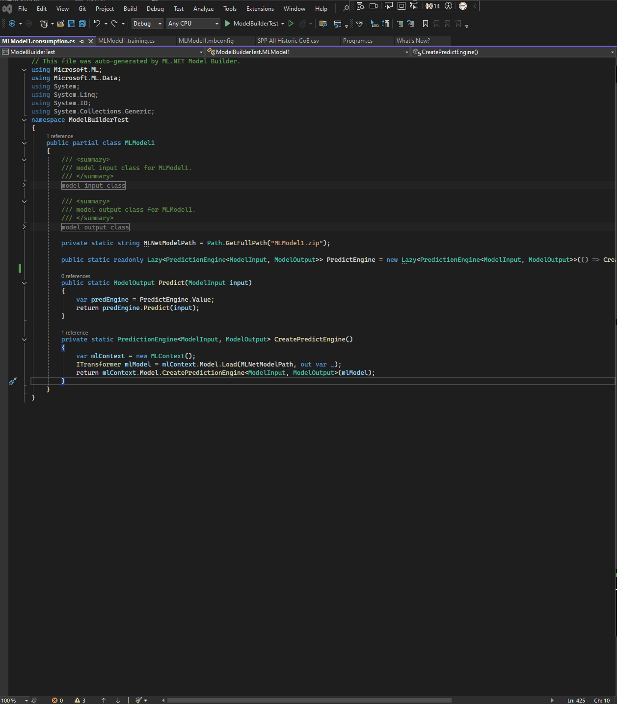

**CodeVoyant Lite** is an AI-powered Visual Studio extension that generates **comprehensive source code comments** directly in your code files. It leverages LLMs like OpenAI’s GPT service or local LLMs to produce high-quality docs that describe **what the code does (not just how it does it)**. Stop writing comments by hand – let CodeVoyant **intelligently document your code** in seconds.



# Features
* **Automated Documentation:** Instantly add language-specifc comment documentation like XML-style `<summary>` descriptions, parameter `<param>` tags, `<returns>` explanations, `<exception>` notes, and more for your functions and classes. Even inserts helpful inline code comments for complex logic.
* **Multiple LLM Support:** Works with OpenAI (ChatGPT API), Azure OpenAI Service, or local models via Ollama. Experiment with OpenAI models for the best bang for the buck, or use a local Llama-based model hosted with your Ollama instance for security and cost cosinderations – CodeVoyant’s flexible backend supports it.
* **Real-Time Streaming:** Documentation appears in your editor as it’s generated, line by line. No waiting for a huge response – see updates live and get immediate feedback.
* **Custom Instructions:** You can customize the style and content of generated docs by providing your own instructions file. Guide the AI to match your project’s style guide or preferences (for example, require `<example>` sections or skip obvious comments).
* **Integrated Workflow:** Use a simple context menu selection inside Visual Studio. The extension allows use of Visual Studio’s undo/redo, formatting, and output window to give a seamless, native feel.
* **Token & Cost Control:** Set daily token limits for each AI provider in the options. This helps manage API usage (for OpenAI/Azure) to avoid unexpected costs by limiting how much content can be processed or generated per day.

# Benefits
* **🙌 Improved Code Quality:** Well-documented code is easier to understand and maintain for both humans and AI. CodeVoyant ensures every method or class gets clear documentation, which helps onboard team members and future-proof your codebase.
* **⏱ Time Savings:** Just thinking about documentation and code comments can be time-consuming. CodeVoyant automates this tedious task – what could take hours can now be ready for review in seconds. Developers can spend more time coding and solving problems, less time writing comments.
* **⚙️ Flexibility:** Whether you prefer OpenAI’s latest models, have an enterprise Azure OpenAI deployment, or need an **offline** solution with local models, CodeVoyant has you covered. Switch providers anytime in the options to suit your needs or environment.
* **🎛 Minimal Setup:** Just install the extension and configure your API keys (for OpenAI/Azure) or local endpoint (for Ollama). No complex configuration – it works out-of-the-box.
* **🔒 Privacy Control:** Concerned about sending code to the cloud? Use Ollama with a local LLM so your code stays on your machine. CodeVoyant gives you the choice to keep things local if required.

# Installation
Install CodeVoyant from the Visual Studio Marketplace (supports VS 2022 and later). After installation, open **Tools > Options > CodeVoyant** to select an LLM provider and enter any required API keys or endpoints. *(See detailed “Help Documentation” below for setup and usage instructions.)*

# License
CodeVoyant comes as a 5-day trial and requires a user-provided LLM service. To continue using after the trial, purchase a license via the Gumroad link [here](https://beanmasters.gumroad.com/l/CodeVoyantLiteForVisualStudio). Enter the license key in the options and restart Visual Studio to activate. (The extension will remind you to activate if the trial has expired.)

- Ollama Setup: https://github.com/ollama/ollama/tree/main
- OpenAI Pricing: https://openai.com/api/pricing/
- Azure Pricing: https://azure.microsoft.com/en-us/pricing/details/cognitive-services/openai-service/

> **Legal Disclaimer:** This extension uses third-party AI services (OpenAI, Azure, etc.). All AI-generated content should be reviewed for accuracy. Use of third-party LLM services is at your own risk; please comply with their terms of service. The extension is provided “as-is” without warranties. See the License for full details.

> This application is provided "as is" without any warranties, either express or implied, including but not limited to the warranties of merchantability, fitness for a particular purpose, and non-infringement. The developer does not control, endorse, or guarantee the accuracy, security, or reliability of any third-party large language model (LLM) services configured or accessed by the user through this application. Use of any third-party LLM service is solely at the user's risk.
The developer shall not be liable for any direct, indirect, incidental, consequential, or special damages, or any damages whatsoever arising out of or in connection with the use or inability to use the application or any third-party LLM service, including but not limited to loss of data, loss of profits, or interruption of business. It is the sole responsibility of the user to assess the suitability, security, and compliance of any third-party LLM service with applicable laws, regulations, and internal policies.
By using this application, you acknowledge and agree that you assume all risks associated with the use of any third-party LLM services and release the developer from any and all liability arising from such use. This disclaimer is provided for general informational purposes only and does not constitute legal advice. Users are encouraged to consult with a qualified legal professional regarding any legal concerns or requirements.

# Help Documentation

## Installation Guide

**Prerequisites:** Microsoft Visual Studio 2022 (or later). (The extension is tested on VS2022; it should also work on VS2022 Community/Professional/Enterprise editions. *If interested in VS2019, join or post an issue.* An internet connection is required for using cloud AI providers (OpenAI/Azure).

**Installation Steps:**

1. **Download & Install Extension:** Get CodeVoyant from the [Visual Studio Marketplace](https://marketplace.visualstudio.com/items?itemName=YourName.CodeVoyant) or via Visual Studio’s **Extensions > Manage Extensions** dialog (search “CodeVoyant”). Click **Download** and follow prompts to install.
   *Alternatively, if you have a .vsix file from Gumroad or GitHub Releases, double-click the `.vsix` file to launch the VSIX Installer.*
   After installation, restart Visual Studio.

2. **Verify Installation:** Once Visual Studio reopens, go to **Extensions > Manage Extensions > Installed**. You should see **CodeVoyant** listed. Also, a new **CodeVoyant** command should be available (for example, in the code editor context menu or a top-level menu). The extension also adds an entry in **Tools > Options** for configuration.

3. **Initial Launch (Trial):** On first use, CodeVoyant will operate in trial mode (5 days full functionality). You do not need to enter a license key initially. Proceed to configuration to set up your AI provider.

### Configuration – Setting up LLM Providers

Before generating documentation, configure which Large Language Model service CodeVoyant should use. Open the **Options** dialog:

* In Visual Studio, go to **Tools > Options**. Scroll to find **CodeVoyant** in the left tree (it might be under “Extensions” or as its own top-level section). Click **CodeVoyant – General** to see the settings.

You will see several categories of settings:

**0. Subscription**

* **License Key:** *(Leave this blank during the trial.)* After purchasing, enter your Gumroad license key here to unlock the extension permanently. (See [Licensing](#licensing-activation) below for details.)

**1. Service Provider**

* **Service Provider:** Choose between `Azure OpenAI API Service`, `OpenAI Service`, or `Ollama Service`. This selection determines which LLM backend is used for generating comments.

  * *Select **OpenAI** if you have an OpenAI API key (for models like GPT-3.5-Turbo or GPT-4 via OpenAI’s platform).*
  * *Select **Azure** if you are using Azure’s OpenAI Service (you have an endpoint and key from Azure).*
  * *Select **Ollama** for using a local model (requires the Ollama service running on your machine).*

Depending on your choice, fill out the corresponding settings category:

**2. OpenAI Settings** (Use if **Service Provider = OpenAI**):

* **Model Name:** The model to use (e.g., `"gpt-3.5-turbo"` or `"gpt-4"` or any other model ID you have access to). Enter the model name exactly as OpenAI defines it.
* **API Key:** Your OpenAI API secret key. *(You can create one at OpenAI’s website if you don’t have it.)* Paste it here. The key is stored securely (it will be encrypted in your settings).
* **Comment Format Instructions File:** (Optional) Path to a custom instructions file on your computer. If you want to override the default documentation style, you can provide a markdown file with instructions for the AI. Otherwise, leave blank to use CodeVoyant’s defaults.
* **Daily Input Token Limit / Daily Output Token Limit:** (Optional) You can set a cap on how many tokens (characters/words) you send to and receive from OpenAI per day. If you’re concerned about API costs, you might set a limit (e.g., 10000 input tokens and 10000 output tokens per day). Set to `-1` for no limit. *(If the limits are exceeded, CodeVoyant will stop generating and likely prompt or log a message.)*

**3. Ollama Settings** (Use if **Service Provider = Ollama**):

* **Model Name:** Name of the local model to use, as recognized by Ollama. For example, `llama2` or `CodeLlama-7B` or any model you have installed. Ensure the model is downloaded and available to the Ollama service.
* **Endpoint URL:** The URL where Ollama is running. Default is `http://localhost:11434/api/chat` (which is the default for Ollama on your local machine). Change this if your Ollama service is on a different address/port.
* **Comment Format Instructions File:** (Optional) Similar to OpenAI above – a path to a custom prompt file for documentation style. Can be the same file if you want consistent style across providers.
* **Daily Input/Output Token Limit:** (Optional) Limits for local generation. (Even though local models don’t have cost, you might limit for performance reasons.)

**4. Azure Settings** (Use if **Service Provider = Azure**):

* **Model Name:** The *deployment name* of your model in Azure OpenAI. (When you deploy a model in Azure, you give it a name, e.g., “GPT35” for the GPT-3.5 model). Enter that deployment name here.
* **Endpoint URI:** Your Azure OpenAI endpoint URL. It looks like `https://<your-resource-name>.openai.azure.com/`. (Copy this from the Azure Portal for your OpenAI resource.)
* **API Key:** The key for your Azure OpenAI resource (from the Azure Portal). Paste it here; it will be encrypted in settings.
* **Comment Format Instructions File:** (Optional) Custom instructions file path, same idea as above.
* **Daily Input/Output Token Limit:** (Optional) As above, to control usage.

After entering the relevant info for your provider, click **OK** to save settings. **Important:** If you entered a license key or changed provider, it’s best to restart Visual Studio to ensure all changes take effect (especially license activation which might require a restart).

*Tips:* It’s recommended to test the setup with a small code snippet to ensure everything is working. If using OpenAI or Azure, you must have an active internet connection. If using Ollama (local), ensure the Ollama server is running before you attempt to use CodeVoyant (you can start it via command line or it might auto-start when called). The first time a local model is invoked, there might be a delay as it loads into memory – subsequent uses will be faster.

## Usage Instructions

Once installed and configured, using CodeVoyant is straightforward. The workflow is: **select code ➜ generate comments ➜ review.**

**1. Open a Code File:** Open a source code file in Visual Studio (for example, a C# file). CodeVoyant is primarily designed for C# (it inserts `///` XML comments and `//` comments appropriately). It may work on other languages with similar comment syntax (like C++ or VB.NET) by inserting comments, but C# is the main target.

**2. Select the Code Block:** Highlight the portion of code you want to document. This could be a single method, an entire class, or even just a section of code. For best results:

* **To document an entire method or class:** include the signature/declaration in your selection. For example, select from the line of the method signature down to the end of the method. This allows the AI to provide a `<summary>` for the method and `<param>` tags for each parameter.
* **To document just a snippet of logic:** you can select a few lines inside a method. CodeVoyant will likely insert inline `//` comments for those lines rather than a top-of-method comment (since the context might not include the method declaration).
* If you want to document a whole file or multiple methods at once, you can select a larger region (even Ctrl+A for the whole file). Be cautious with very large selections as the AI might hit context limits – but CodeVoyant will try its best, possibly focusing on one element at a time.

**3. Trigger CodeVoyant – “Generate Documentation”:** There are a few ways to invoke the documentation generation:

* **Context Menu:** Right-click on the selected code. In the context menu, look for **“CodeVoyant: Generate Documentation”** (or similar wording). Click it.
* **Keyboard Shortcut:** *(If configured)*. CodeVoyant might not have a default shortcut out-of-the-box. You can set one in **Options > Environment > Keyboard** by assigning a hotkey to the CodeVoyant command (look for commands named “CodeVoyantCommand” or similar). If you set, for example, `Ctrl+Shift+D` (which GhostDoc uses) or another combination, you can trigger it via keyboard.
* **Menu Bar:** There may be a top menu item (e.g., **Extensions > CodeVoyant > Generate Documentation**). This depends on how the extension is registered. If it exists, you can click that menu item.
* **Toolbar Button:** If CodeVoyant added a toolbar button, simply click the icon (likely the CodeVoyant logo) while your text is selected.

Upon triggering, CodeVoyant will start processing the selection:

* *Behind the scenes:* It sends your selected code to the chosen LLM along with its system instructions (which tell the AI to document the code without altering it). It opens an **Undo context** (so that all changes can be undone together if needed).
* **Visual feedback:** Visual Studio’s status bar will show a spinner (the extension triggers the VS busy animation). You might also see output in the Output Window (a “CodeVoyant” pane) logging the progress for debugging purposes. The selected text will become unselected, and shortly after, you’ll see text start to appear in your code editor.

**4. Watch Documentation Appear:** CodeVoyant streams the AI’s response directly into the editor. You will literally see text being inserted at the location of your selection. It will first insert the original code (since it temporarily removed it to re-insert with comments) and intermix comments. The experience is that your code reappears with `///` comments above methods and `//` inline comments where needed, materializing line by line. This streaming means you don’t have to wait for the entire AI response to finish before seeing results – longer documentation will appear gradually.

* During this process, avoid typing or editing the document. The extension has locked the document for editing while it inserts content. If you try to intervene, you may get a warning or simply interrupt the process.
* Typical generation time can range from a few seconds to maybe 30 seconds, depending on code size and the AI model (GPT-4 is slower than GPT-3.5, local models vary by your hardware speed). The Output Window (if opened to the CodeVoyant pane) might show debug info like token counts or partial text (you generally don’t need to monitor this unless troubleshooting).

**5. Completion & Formatting:** Once the AI has finished, CodeVoyant will unlock the document and do a few post-processing steps:

* It will remove any trailing extra newline the AI might have added at the end of your selection.
* It then formats the inserted text. It uses Visual Studio’s **Edit.FormatSelection** command to properly indent and align the new comments with your code. This ensures the XML comments align with your code’s indentation level, and any inline comments are spaced correctly.
* The caret (cursor) will end up at the end of the newly inserted text (i.e., after the last generated comment/code line).

Now your code is augmented with documentation! For example, if you had a method:

```csharp
public int Add(int a, int b)
{
    if (a < 0 || b < 0)
        throw new ArgumentOutOfRangeException();
    return a + b;
}
```

After running CodeVoyant, it might turn into:

```csharp
/// <summary>
/// Calculates the sum of two integers.
/// </summary>
/// <param name="a">The first integer to add. Must be non-negative.</param>
/// <param name="b">The second integer to add. Must be non-negative.</param>
/// <returns>The sum of <paramref name="a"/> and <paramref name="b"/>.</returns>
/// <exception cref="System.ArgumentOutOfRangeException">
/// Thrown if either <paramref name="a"/> or <paramref name="b"/> is negative.
/// </exception>
public int Add(int a, int b)
{
    // Ensure inputs are non-negative
    if (a < 0 || b < 0)
        throw new ArgumentOutOfRangeException();

    // Return the sum
    return a + b;
}
```

As you can see, it added a `<summary>` explaining the method’s purpose, `<param>` tags for each parameter, a `<returns>`, an `<exception>` for the thrown exception, and even inline comments inside the method body for clarity. *(This is just an example; the actual output may vary based on context and AI, but it illustrates the goal.)*

**6. Review and Edit:** While CodeVoyant aims for accuracy, you should review the generated comments:

* Check that the summaries and descriptions are correct. The AI infers intent from code; ensure it didn’t misunderstand something. For straightforward code, it should be quite accurate. For very complex logic, verify that the comment indeed captures the intent.
* Edit any wording if needed. The comments are now regular text in your code – you can tweak phrasing, add details, or remove any commentary you find unnecessary.
* Particularly check any content in `<remarks>` or `<example>` (if generated) to ensure they make sense in your context.
* If the AI skipped obvious self-explanatory code (like trivial getters or simple assignments) as per instructions, that’s intentional to avoid noise. If you do want comments there, you can either manually add or consider adjusting instructions (see Tips below).

**7. Save Changes:** Once satisfied, save your file. The Undo context opened by CodeVoyant means that if something went wrong (e.g., you got an output you don’t like or there was an interruption), you can hit **Undo** (`Ctrl+Z`) once to revert the entire insertion and get back your original code. This safety net ensures you won’t lose code by accident.

**Common Usage Scenarios:**

* Documenting a new function right after writing it (before moving on).
* Backfilling documentation for legacy code – you can go method by method, or select a whole class to document many members at once.
* Getting a quick understanding of unfamiliar code: even if you don’t intend to keep the comments, running CodeVoyant on someone else’s code can give you an explanation of what it does (like an AI code review). This can be a learning tool.

## Tips for Best Results

To get the most out of CodeVoyant, consider these tips and best practices:

* **Use source control:** The AI CAN alter code in its response, typicaly reframing identical logic in newer coding styles, however, always compare, contrast and verify changes!

* **Select logical units of code:** The AI does best when it has context. Selecting an entire method (including its signature) gives it context about parameters and purpose, yielding better `<summary>` and `<param>` docs. If you only select inside a method, it might not know the method name or purpose, so it will just comment the lines. When possible, include the method or property signature in the selection for fuller docs.

* **Meaningful Names Help:** The AI will use identifiers (method name, parameter names) as clues. If your function is named `CalculateInvoiceTotal`, the summary will likely be great. If your function is named `DoIt` with parameters `x` and `y`, the AI has less to go on. In such cases, consider renaming things for clarity (a side benefit: encourages good naming). Or be ready to edit the AI’s output if it has to guess.

* **Leverage Custom Instructions:** If you have specific documentation standards:

  * Create a markdown file with additional instructions or examples. For instance, you might write: “Always include an `<example>` section with sample usage,” or “Use Markdown in <remarks> for code blocks.” Save this file and point CodeVoyant to it via the **Comment Format Instructions File** setting.
  * CodeVoyant will include your custom prompt for the AI, influencing its output. This can enforce consistency or special requirements across a team.
  * The repository includes a default `SystemInstructions.md` (the built-in guidance for the AI) and a `C#CommentFormats.md` that detail how to format comments. Reviewing those can help you understand what the AI is instructed to do by default.

* **Model Selection:** If using OpenAI:

  * `gpt-3.5-turbo` is fast and cost-effective, and usually produces good results for documentation on small-to-medium code.
  * `gpt-4` is more capable with complex or larger code (and may produce more insightful comments), but it is slower and has higher cost. Use it for especially critical documentation or very complex code fragments where quality matters more.
  * Azure OpenAI users similarly might have deployments of these models. Ensure your model deployment has enough max tokens to handle the code (if documenting a large class, the model needs sufficient context length).
  * With **Ollama** (local models), quality varies by model. A smaller model (7B parameters) might produce okay summaries for small functions but could miss nuances. Larger models (13B, 30B) will do better but require more memory. If using Code Llama or similar code-specialized models locally, you might get decent results. It’s a trade-off for privacy – be mindful that local models might need you to review/edit a bit more.

* **Iterate if Needed:** AI content generation isn’t deterministic (unless you use temperature 0 as default in some cases). If a generated comment is not satisfactory, you can undo and try again. It may word things differently the second time. If it *consistently* doesn’t do what you want (e.g., it’s skipping something important or adding too much detail), adjust the instructions or just manually edit the result. Over time, you’ll get a feel for what kind of output to expect and instruct accordingly.

* **Avoid Over-Commenting:** The goal is to document **what** the code does and any important why’s – not to explain every line of trivial code. The default instructions already tell the AI to avoid commenting self-evident code. This leads to cleaner documentation. Trust this judgment; it keeps comments high-value. If you find the AI left something out that you do want, you can add a comment manually or tweak the prompt to be more verbose. In general, less is more when the code is obvious (e.g., it won’t comment `i++` loop increments or simple property getters).

* **Be mindful of API limits:** If you set token limits (or if you’re on a trial tier of an API), the extension will enforce those. If CodeVoyant stops generating and reports in the Output window that a token limit was hit, you may need to increase or disable the limit in Options or wait until the next day (the limits reset daily) to generate more documentation. This is primarily to protect you from unexpected usage (especially if using a personal OpenAI API key). If you’re actively documenting a large project, you might raise these limits or watch your API account’s usage on the provider’s dashboard.

* **Check the Output Window for Errors:** If nothing happens when you trigger generation, open **View > Output** and select “CodeVoyant” from the drop-down. Error messages or warnings might be printed there. For instance, if your API key is invalid or you mis-typed the model name, you’ll see an error from the API. Common mistakes: wrong Azure endpoint URL format, or not having the Ollama service running. Fix any issues and try again.

* **Using with Other Extensions:** CodeVoyant should play nicely with other tools. For example, if you have formatting tools like ReSharper or CodeMaid, the inserted comments might trigger their inspections (like spelling checks or formatting suggestions). That’s usually fine. One thing to note: if you have GitHub Copilot active, Copilot might try to also suggest comments when you type `///`. When using CodeVoyant, you’re bypassing Copilot’s suggestion flow by selecting and commanding generation, so they shouldn’t conflict. In fact, you can use both: Copilot for on-the-fly suggestions and CodeVoyant for bulk or on-demand documentation.

## Licensing & Activation

CodeVoyant is a paid extension with a **5-day free trial**. Here’s how the licensing works and how to activate your copy:

* **Trial Period:** Upon installation, the extension is fully functional with all features for 5 days. The trial begins the first time you use CodeVoyant. During this time, you might see occasional reminders of how many days are left in your trial (perhaps in the Output Window or as a popup). Use this period to evaluate the tool in your workflow.

* **Purchase a License:** If you find CodeVoyant useful (🎉 we hope you do!), you can purchase a license on Gumroad. The product page is [beanmasters.gumroad.com/l/CodeVoyantLiteForVisualStudio](https://beanmasters.gumroad.com/l/CodeVoyantLiteForVisualStudio) (the link is also provided in the extension’s trial reminder dialog). Complete the purchase, and Gumroad will provide you with a **license key**, typically a string of characters.

* **Activating the License:** In Visual Studio, go to **Tools > Options > CodeVoyant > General** (the same place where you configured providers). In the **License Key** field (under Subscription), paste your license key. Press OK to save.
  It’s recommended to **restart Visual Studio** after entering the key to ensure the license check is fully recognized. After restart, the extension will validate the license. If the key is valid, the trial restrictions are lifted and you can continue using CodeVoyant indefinitely. If the key was invalid (or a typo), you’ll get an error prompt “License expired or invalid” when you try to use the extension. Double-check the key and that you included the full string without extra spaces.

* **License Validation:** CodeVoyant performs a license or trial check whenever you trigger the generation command. If you are outside the trial window and no valid license is present, it will **not generate comments**; instead, it will show a message box indicating the license is expired and provide the Gumroad link to purchase. This ensures compliance. Once you activate with a valid key, that check will pass and you’ll be able to use the tool normally.

* **Offline Usage:** The license check is done within the extension (the license key likely encodes the expiration or is verified via an algorithm). You do not need to be online for the license to work after activation. (However, note that using OpenAI/Azure requires internet by nature for the AI calls.)

* **License Scope:** Each license is presumably per user/developer. If you use multiple machines, you might use the same key on them (if allowed by the terms; check the License Agreement). Do not share the key publicly. The license is “revocable” and tied to internal use as per the EULA.

* **Upgrades:** Minor upgrades of CodeVoyant (v1.x to v1.y) will recognize the same license. If a major new version is released, the developer might issue new keys or upgrades – details would be announced. (This is speculative; include if you have a policy on major version licensing.)

* **Uninstalling/Reinstalling:** If you uninstall the extension, your license key may remain in the VS settings (or not, depending on VS behavior). It’s good to keep a copy of your license key in a safe place (the Gumroad receipt email, for instance). You can re-enter it if needed.

* **Support:** For any issues with licensing (e.g., your key isn’t working, or you purchased but didn’t receive a key), contact the support email or Gumroad seller (Bean Masters, presumably) for assistance.

* **License Agreement:** The extension comes with a software license agreement (see *License.txt* in the installation or on the GitHub repo). It basically states that the software is provided as-is, and that using third-party AI services through it is at your own risk. It prohibits redistributing the extension or attempting to reverse-engineer it. By activating, you agree to these terms. (This is standard; just be aware, especially if using in a corporate environment – one license per user, etc.)

## Troubleshooting & FAQ

* **“The extension isn’t doing anything when I click generate.”**
  – Make sure you have some code selected. The tool will not run if nothing is selected, and will show a message “No code selected.”. Also confirm your license/trial is still valid; if not, it will refuse to run. Check the Output window for any error logs. Lastly, ensure your configuration (API keys, etc.) is correct; an invalid API key could result in no response.

* **“I got an error about token limit or API.”**
  – This means either you hit a self-imposed token limit (adjust in Options or set to -1 for unlimited), or the AI service returned an error. For OpenAI, common errors are invalid API key, or model not found (check model name), or quota exceeded. For Azure, ensure your endpoint URL and deployment name are correct and that your resource has available quota. For Ollama, the error might say it can’t connect to the endpoint – ensure Ollama is running and the URL is correct.

* **“The comments aren’t in my language (not localized).”**
  – CodeVoyant does not translate comments; it generates them in English by default (since that’s the typical language for code documentation). If you need another language, you might try adding a custom instruction like “Respond in Spanish” in a custom prompt file, but results may vary. The primary use case is English documentation.

* **“Can I use this for languages other than C#?”**
  – The current version is optimized for C# (.NET) using XML comments. If you use it on a C++ file, it might still insert comments (it will detect the file’s language and attempt something). But XML `<summary>` tags in C++ are not typical (C++ uses either `///` or `/** ... */` with Doxygen or triple slash if enabled). We have not explicitly added support for Doxygen format. Future versions may expand language support. For now, consider it a C# targeted tool. (It will still put `//` inline comments in any language for line comments.)

* **“How do I update CodeVoyant?”**
  – Updates, when released, will be available via the Visual Studio Marketplace. You can update through **Extensions > Manage Extensions > Updates** within VS. Your settings and license will carry over. Check the GitHub releases or marketplace changelog for what’s new in each update.

This concludes the help documentation. Happy documenting with CodeVoyant! If you have further questions or need support, please refer to our GitHub repository’s Issues section or contact the developer via the support email provided. Enjoy your more documented and maintainable codebase!
